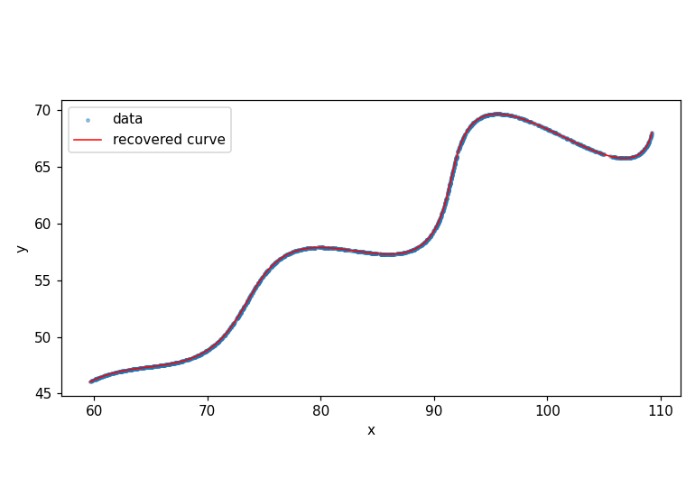

problem: 

find theta, m, x in the parametric curve

x(t) = t*cos(theta) - e^(m|t|)*sin(0.3t)*sin(theta) + x

y(t) = 42 + t*sin(theta) + e^(m|t|)*sin(0.3t)*cos(theta)

given 1500 data points for t in [6, 60]

constraints 0 < theta < 50 deg, -0.05 < m < 0.05, 0 < x < 100

my approach

attempt 1 grid search

3d grid over theta, m, x. too slow, abandoned.

Next attempt random guesses

scipy least_squares with random starts. stuck in local minima, rms ~21000. theta and x are coupled.

Next attempt pca....

plotted data, saw rotated linear trend. remembered pca from linear algebra class finds max variance direction.

steps

1. center data

2. covariance matrix

3. eigenvectors for major axis

4. initial theta = 28.48 deg

estimated x from centroid.

Soo, final attempt

rotate by theta, equation decouples. u = t, v = e^(mt)*sin(0.3t). fit m from log slope.

final refinement

pca guess into scipy least_squares with bounds. converged.

results

theta = 30.0000 deg (0.523598 rad)

m = 0.03000

x = 55.0000

rms residual = 3.49e-06

max point to curve distance = 9.58e-04

visualization

desmos verification

[view on desmos](https://www.desmos.com/calculator/gsm54tztny)

files

solution3.py final code

solution1.py first attempt

solution2.py second attempt

xy_data.csv input data

fit.png plot

paste this to run 

pip install numpy scipy matplotlib

python solution3.py
